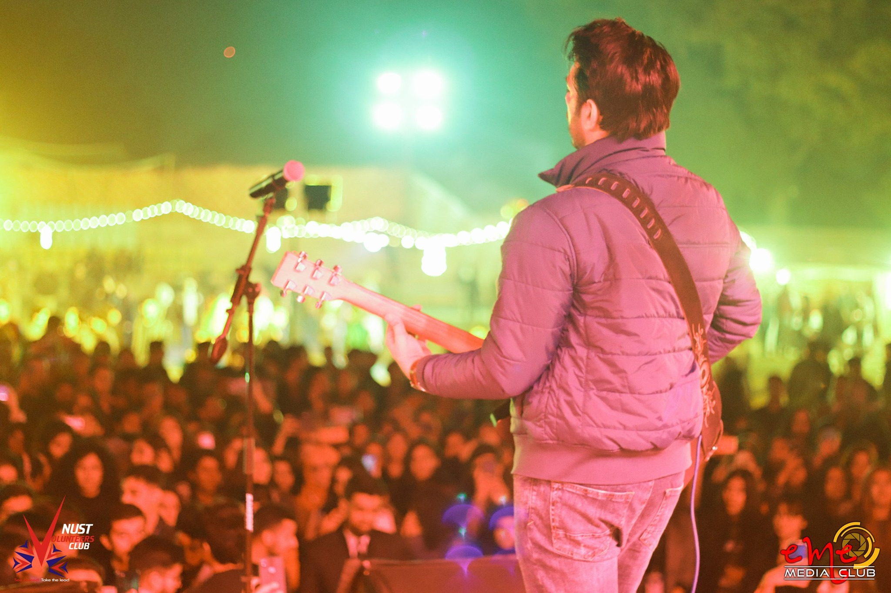
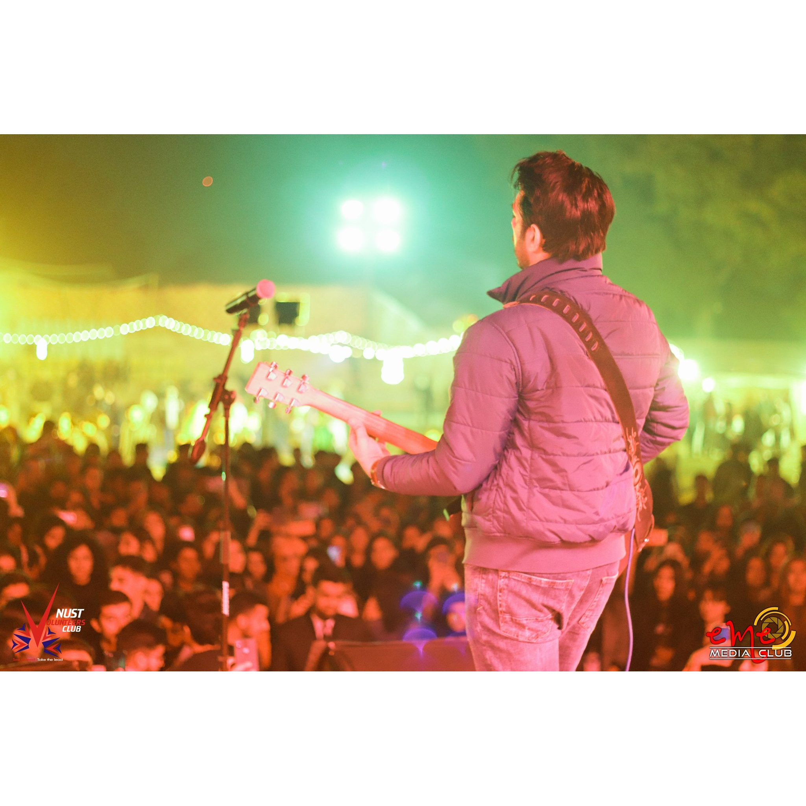
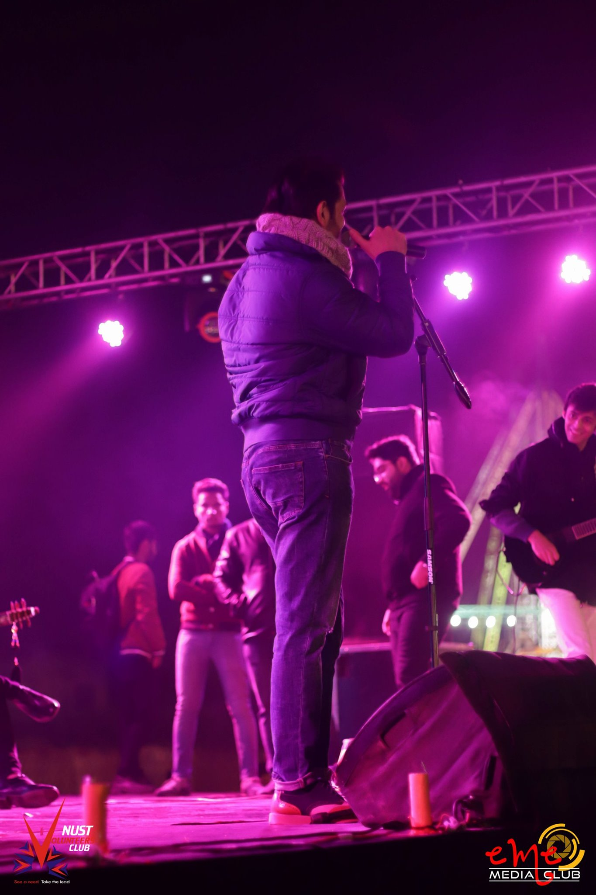
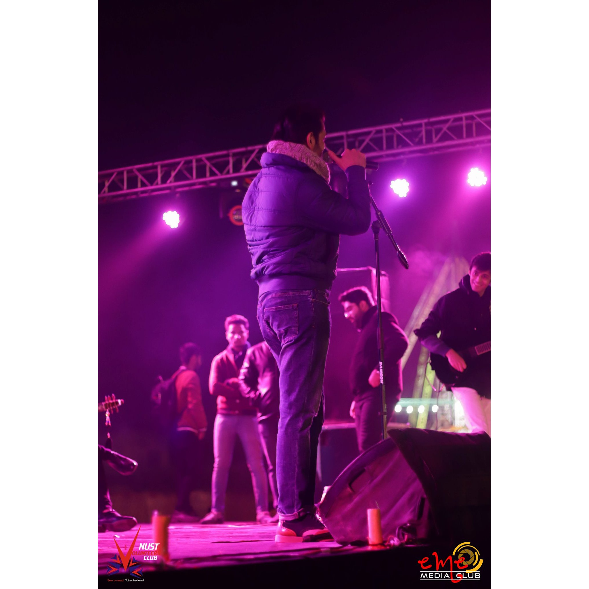

### image-squarer
A simple python script to convert portrait or landscape images to a square (ideally for Instagram posts)

### How to use

- Download or clone the repository
- Use `python main.py --path <path> --out [out]`

### Available arguments

- `--path`: Either a path to the image or path to a directory containing images or subdirectories (can be nested as well)
- `--out`: Path to store the squared image(s)
- `--loop`: When a directory in provided `--path` then this should also be passed
- `--size`: [Optional], provide a custom size for the output image
- `--color`: [Optional], border color, default: (255,255,255) in BGR format

### Examples

|    Input Image     |    Output Image     |
|:------------------:|:-------------------:|
|  |  |
|  |  |